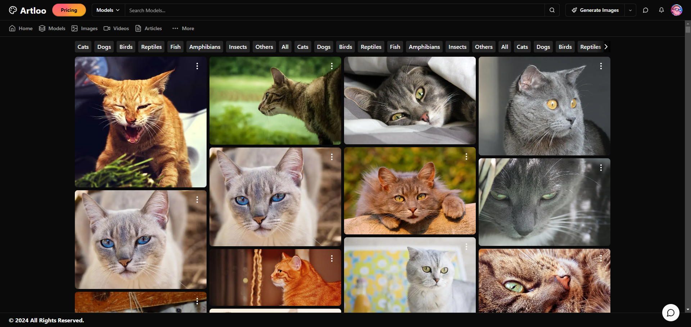

artloo, an art sharing website heavily inspired by civitai, pixiv, devianart and many more sites.  
tech stack used

- nextjs
- tailwind
- shadcn
- zod
- react resizeable panel
- radix
- vaul
- react hook form
- zustand

home page

images page

chat page

generator page

